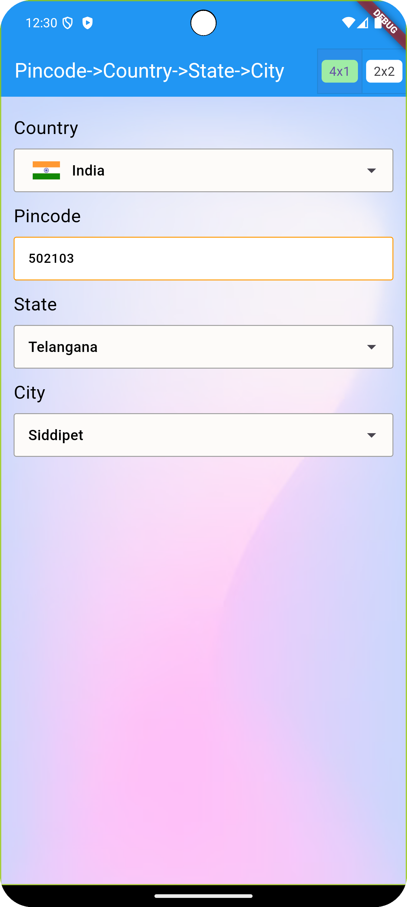

# 📦 pincode_address_picker

A complete Flutter package to pick and validate **Country → State → City** using dropdowns, or auto-fill them by entering a **pincode/postal code**.

✅ Built-in country/state/city dataset  
✅ Auto-fill from pincode  
✅ Supports layout customization  
✅ Individual utilities for custom use

> Perfect for apps that collect addresses: e-commerce, delivery, registration, checkout, etc.

---

## ✨ Features

- 📍 **Pincode to City/State** auto-detection
- 🌐 Built-in dataset of countries, states, and cities (with lat/lng and postal info)
- 🧩 Customizable UI layouts (4x1 column or 2x2 grid)
- 🎯 RegEx-based validation for postal codes by country
- 🔧 Exposed utility APIs if you want to use your own UI

---

## 🚀 Getting Started

### 1. Add to `pubspec.yaml`

```yaml
dependencies:
  pincode_address_picker: ^1.0.0
```

### 2. Usage

#### Using the default picker UI
```dart
final controller = AddressPickerController();

PincodeCountryStateCityPicker(
  controller: controller,
  gridType: GridType.grid4x1, // or GridType.grid2x2
  showCountryFlag: true //show the country flag
)
```


## 🖼 Layout Options
#### Support two pre-defined layouts:

#### GridType.grid4x1 → All fields in vertical column

#### GridType.grid2x2 → 2×2 compact grid

## 🛠 AddressPickerController

#### This controller helps you manage and listen to the selected country, state, city, and pincode.

```dart
final controller = AddressPickerController();

controller.selectedCountry.addListener(() {
  print(controller.selectedCountry.value?.name);
});
```

## Get selected values

```dart
controller.selectedCountry.value;
controller.selectedState.value;
controller.selectedCity.value;
```

## 🧪 If You Want Only the Data
#### You can use the utility APIs without the picker UI.

## 🗺 Get Countries
```dart
List<Country> countries = await getAllCountries();
Country? india = await getCountryByIsoCode(isoCode: "IN");
```
## 🏙 Get States
```dart
List<StateModel> states = await getStatesOfCountry(countryCode: "IN");
StateModel? state = await getStateByCode(countryCode: "IN", stateCode: "TG");
```

## 🏡 Get Cities
```dart
List<City> cities = await getCitiesOfState(countryCode: "IN", stateCode: "AP");
City? city = await getCityByPostalCode(postalCode: "502103", countryCode: "TG");
```

### 🗺 🏙 🏡  Get Address(State, City) from postalCode
```dart
AddressData addressData = await getStateAndCityByPostalCode(postalCode: "502103", countryCode: "IN");
State state = addressData.state;
City city = addressData.city;
```

### Get PostalCodeFormat from countryCode
```dart
PostalCodeFormat? postalCodeFormat = getPostalFormatFromCountryCode(countryCode : "IN");
```
<a href="https://github.com/VARKOLU1729/pincode_country_state_city_pro/blob/main/lib/src/pincode_country_state_city_data.dart">
  For more APIs, check this file
</a>

## Additional information

🙌 Contributing : 
Found a bug? Want to add more data or improve UX?
PRs are welcome!!  Open issues, contribute, or star the repo 💙
